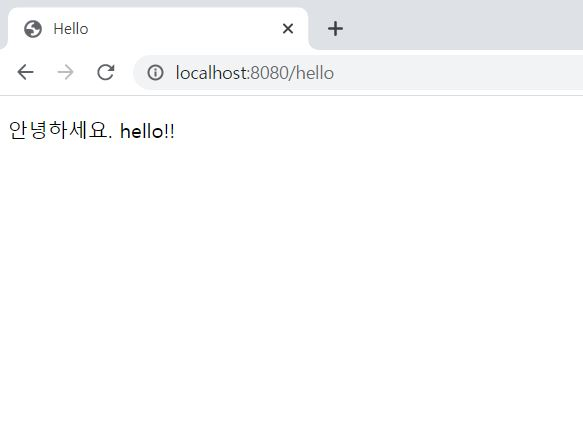

### 템플릿 엔진을 사용하여

<br>

```@GetMapping("hello")``` <br> /hello로 들어가면 웹어플리케이션에서  ```@GetMapping``` 하단부 메서드를 호출한다.<br>


```return "hello";```<br>
templates/hello.html 파일을 찾아 실행시켜라

```java

/*  src/main/java/hello-spring/controller(package)/HelloController(class) 생성  */
package hello.hellospring.controller;

import org.springframework.stereotype.Controller;
import org.springframework.ui.Model;
import org.springframework.web.bind.annotation.GetMapping;

@Controller
public class HelloController {

    @GetMapping("hello")
    public String hello(Model model){
        model.addAttribute("data", "hello!!");
        return "hello";

    }

}
```
<br>

---
<br>

```${data}```
<br>위 contorller의 ```model.addAttribute("data", "hello!!");```에서의 key값에 해당한다. value에 해당하는 후자 hello!!로 치환된다.

 ```html
 <!-- src/main/resources/templates/hello.html -->

<!DOCTYPE HTML>
<html xmlns:th="http://www.thymeleaf.org">
<head>
    <title>Hello</title>
    <meta http-equiv="Content-Type" content="text/html; charset=UTF-8"/>
</head>
<body>
<p th:text="'안녕하세요. ' + ${data}">안녕하세요. 손님</p>
</body>
</html>
```
<br>
#### 빌드하고 실행하기<br>
(window) ```gradlew build``` 한 뒤<br>
build/libs/ 경로로 들어가고<br>
```java -jar ~-SNAPSHOT.jar```<br>
서버 배포할 때는 위 파일만 복사해서 서버에 넣어주고 위 명령어로 실행시키면 된다. 그러면 스프링이 서버에서 동작하게 된다.<br><br>

#### 실행화면


