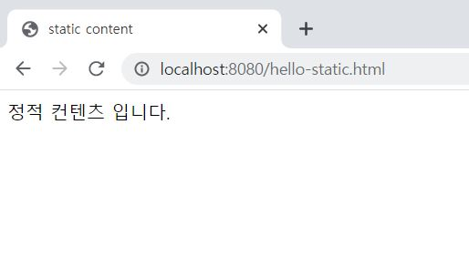
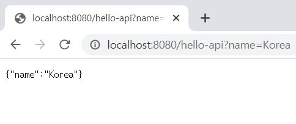

### 스프링 웹 개발 기초
* 정적 컨텐츠
html 파일을 **그대로** 웹브라우저에 보여줌
* MVC와 템플릿 엔진
서버에서 프로그래밍하여 html을 동적으로 **바꾼 뒤** 던져줌
controller, model, template engine 화면 이 세 가지를 Model View controller라고 하여 MVC라고 한다.
* API
json과 같은 format으로 클라이언트에게 데이터를 전달함
<br>

---

### 정적 컨텐츠

static/hello-static.html 파일을 만들었다.
```html
<!DOCTYPE HTML>
<html>
<head>
    <title>static content</title>
    <meta http-equiv="Content-Type" content="text/html; charset=UTF-8"/>
</head>
<body>
정적 컨텐츠 입니다.
</body>
</html>
```
<br>

#### 실행 결과


<br>

#### 동작 방법

1. 파일명 그대로 ```localhost:8080/hello-static.html``` 으로 들어가게 되면
2. 컨트롤러 쪽에서 매핑된 컨트롤러를 찾아본다
3. 관련 컨트롤러가 없어서 ```resources/static/hello-static.html```을 찾는다.
4. 존재하면 해당 정적 파일 그대로 반환된다.
<br>

---

### MVC와 템플릿 엔진
MVC : Model, View, Controller<br>
view는 화면과 관련된 일만,<br>
Controller는 뒷단과 관련된 일,<br>
Model에 화면에 필요한 것을 담아 넘겨 줌
<br>

이번에는 외부에서 파라미터 입력을 받을 것이다.<br>

```@RequestParam```<br>
외부에서 파라미터 입력을 받을 때 사용한다.
<br> 
```Model model```<br>
이에 담아 넘겨주면 view에서 렌더링 할 때 사용한다.
파라미터로 들어온 name을 넘겨준다.<br>
name(key) : name(외부로부터 들어온 value)<br>
```return "hello-template";```<br>
templates/hello-template.html 파일로 찾아간다.

 ```java
    @GetMapping("hello-mvc")
    public String helloMvc(@RequestParam("name") String name, Model model){
        model.addAttribute("name", name);
        return "hello-template";
    }
```
<br><br>

서버가 돌아가면 hello! empty -> text = ~ 의 물결 부분으로 치환이 된다.

```html
<html xmlns:th="http://www.thymeleaf.org">
<body>
<p th:text="'hello ' + ${name}">hello! empty</p>
</body>
</html>
```
<br>

##### 실행 결과


파라미터 정보 보려면 Ctrl + p


#### 코드 동작 방법
1. http에서 GET 방식으로 파라미터를 넘겨준다.<br>
    ```localhost:8080/hello-mvc?name=Spring~!``` 에서의 ```?name=Spring~!```
2. ```public String helloMvc(@RequestParam("name") String name, Model model)``` 파라미터 중 name에 Spring~! 이 들어가고<br>
    ```model.addAttribute("name", name);``` name이라는 key의 value로서 Spring~!이 들어간다.<br>

3. Model에 담기고 템플릿으로 넘어가면 ```${name}```은 Model에서 담긴 정보 중  key가 name인 것의 value로 치환한다.

그렇게 변환된 html이 결과로 나왔다.<br><br>

#### 내부 동작 방법
1. ```localhost:8080/hello-mvc?name=Spring~!```
2. 내장 **톰켓 서버**를 거치면서 스프링에게 이를 알린다.
3. **Controller**에서 매핑된 메서드를 호출하고 return 시 hello-template, model(name:spring~!)
4. **viewResolver**에게 넘겨짐. 화면과 관련된 동작. view를 찾아주고 템플릿 엔진을 연결시켜줌. return ~과 똑같은 ~를 찾아 Thymeleaf 엔진에게 처리해달라고 넘겨줌
5. **Thymeleaf 엔진**은 **변환을 한** html을 반환해준다.


<br>

---

### API

```@ResponseBody```
* http에는 Header와 body부가 있는데 body부에 직접 넣어주겠다.
*  view가 없다.
*  return이 객체이고 ```@ResponseBody```라고 해놓으면 json으로 반환하는 것이 기본이다.
*  json 파일은 {key : value} 의 형태이다.


```java
    @GetMapping("hello-api")
    @ResponseBody
    public Hello helloApi(@RequestParam("name") String name){
        //자동완성단축키 Ctrl + Shift + Enter
        Hello hello = new Hello();
        hello.setName(name);
        
        //객체를 반환
        return hello;
    }

    /* Hello class, property 접근 방식 */
    static class Hello{
        private String name;
        public String getName() {
            return name;
        }

        public void setName(String name) {
            this.name = name;
        }
    }
```


#### 실행 결과



#### @ResponseBody 사용 원리
1. localhost:8080/hello-api
2. 내장 톰켓 서버가 스프링에게 정보가 왔음을 알린다.
3. Controller을 찾고 @ResponseBody라는 annotation이 붙어있기 때문에 http 응답으로 데이터를 넘겨야 겠구나 라고 생각한다.
   * return이 문자열이면 바로 넘겨주면 되는데
   * return이 위와 같이 객체면 json 방식으로 데이터를 만들어서 http 응답으로 반환.
4. ```viewResolver``` 대신 ```HttpMessageConverter```이 동작한다. ```MappingJackson2HttpMessageConverter```과 <br> ```StringHttpMessageConverter```이 있는데 <br>
   무엇을 return하느냐에 따라 둘 중 하나가 작동한다. <br>
   전자는 객체를 Jackson 라이브러리를 통해 json 파일로 변환해주는 것이다. 그리하여 http body부에 실어 보낸다.
