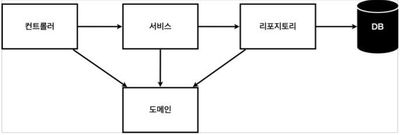
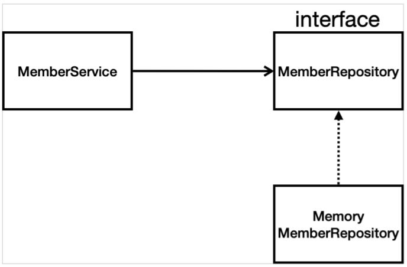

## 회원 관리 예제

* 비즈니스 요구사항정리
* 회원 도메인과 리포지토리(회원 도메인과 회원 도메인 객체를 저장하고 불러올 수 있는 저장소)
* 회원 리포지토리 정상 동작하는지 테스크 케이스 작성
* 서비스 개발
* 서비스 테스트(j unit이라는 테스트 프레임워크)

### 비즈니스 요구사항 정리
* 데이터: 회원 ID(시스템에서 지정), 이름
* 기능 : 회원 등록, 조회
* 아직 데이터 저장소가 선정되지 않는 경우를 가정

**일반적인 웹 애플리케이션 계층 구조**


* 컨트롤러 : 웹 MVC의 컨트롤러 역할
* 서비스 : 비즈니스 도메인 객체를 통해 핵심 비즈니스 로직 구현(회원 중복가입 불가 ...)
* 리포지토리 : 데이터베이스에 접근 도메인 객체를 DB에 저장하고 관리
* 도메인 : 회원, 주문, 쿠폰 등 데이터베이스에 저장하고 관리되는 비즈니스 도메인 객체

<br>

**클래스 의존 관계**


MemberRepository는 interface로 설계할 예정. 이유는 아직 데이터 저장소가 선정되지 않았기 때문이다.<br>
구현체를 우선은 메모리 구현체로 만들 예정이다. 일단 개발은 해야하니 메모리로 단순하게 구현한 뒤 향후 DB가 정해지면 그에 맞게 구현 클래스를 변경할 것이다. 바꿔 끼우기 위해서 interface로 정의한다.

### 회원 도메인과 리포지토리 만들기

**회원 도메인**

```java
/* main/java/hello.hellospring/domain(package)/Member(class) 생성 */

package hello.hellospring.domain;

public class Member {
    private Long id;
    private String name;

    public Long getId() {
        return id;
    }

    public void setId(Long id) {
        this.id = id;
    }

    public String getName() {
        return name;
    }

    public void setName(String name) {
        this.name = name;
    }
}
```

* 이때의 id는 user이 사용하는 아이디가 아닌 시스템 상에서의 user 구분 아이디.

<br>

**리포지토리**
```java
/* main/java/hello.hellospring/repository(package)/MemberRepository(interface)  */
package hello.hellospring.repository;

import hello.hellospring.domain.Member;

import java.util.List;
import java.util.Optional;

public interface MemberRepository {
    // 저장
    Member save(Member member);
    
    //저장소에서 찾기
    Optional<Member>findById(Long id);
    Optional<Member>findByName(String name);

    // 저장소에 있는 모든 회원 리스트를 반환
    List<Member>findAll();
}
```
* 회원 객체를 저장하는 저장소
* Optional : find by ~ 할 때에 관련 데이터를 찾을 수 없으면 null을 반환할텐데 이때 null을 처리하는 기법 
<br>

**리포지토리 구현체**
```java
/* main/java/hello.hellospring/repository(package)/MemoryMemberRepository(class) */
package hello.hellospring.repository;

import hello.hellospring.domain.Member;

import java.util.*;

/* Alt + Enter -> implement methods -> 모든 메소드 선택 */
public class MemoryMemberRepository implements MemberRepository{

    private static Map<Long, Member> store = new HashMap<>();
    private static long sequence = 0L;

    @Override
    public Member save(Member member) {
        member.setId(++sequence);
        store.put(member.getId(), member);
        return member;
    }

    @Override
    public Optional<Member> findById(Long id) {
        /*
        store에서 꺼냄
        꺼낸 결과가 없어 Null이 반환될 수 있음. 이런 경우,
        Optional.ofNullable로 감싸준다. 이렇게 할 시 클라이언트에서 무언가 할 수 있다.
        */
        return Optional.ofNullable(store.get(id));
    }

    @Override
    public Optional<Member> findByName(String name) {
        return store.values().stream()
                .filter(member->member.getName().equals(name))
                .findAny();
    }

    @Override
    public List<Member> findAll() {
        return new ArrayList<>(store.values());
    }

    public void clearStore(){
        store.clear();
    }
}
```
* import시 Alt + Enter
* ```Map``` : 딕셔너리 기능. key(회원 ID) : value(Member)
* ```sequence``` : 0, 1, 2, ... key를 생성시켜줌
* ```save``` : 이름은 사용자가, 회원 id는 시스템 상에서 생성.
* ```Optional.ofNullable``` : null의 반환 가능성 있을 시 이렇게 감싸 반환하면 클라이언트 부분에서 sth를 할 수 있다.
* ```stream().filter(조건)``` : filter은 stream 내 요소들을 하나씩 평가해서 걸러내는 작업
* 실무에서는 List를 많이 사용한다. store.values()는 Member에 해당된다(왜? ```Map<Long, Member> store```라고 정의했었다)
<br>
<br>
<br>
---

### 회원 리포지토리 테스트케이스 작성

내가 원하는대로 정상 작동하는지 검증하는 방법! 코드를 코드로 검증하게 된다.

<br>
main 메서드를 통해 실행하거나 웹 어플리케이션 컨트롤러를 통해서도 가능하지만 이는 준비하고 실행하는 데에 소요 시간이 오래 걸린다. 또한 반복 실행하기 어렵고 여러 테스트를 한번에 실행하기 어렵다.<br>

   **JUnit를 통해 테스트를 실행한다**

<br><br>

**Test code**
```java
/* test/repository(package)/MemoryMemberRepositoryTest(class) */
package hello.hellospring.repository;

import hello.hellospring.domain.Member;
import org.assertj.core.api.Assertions;
import org.junit.jupiter.api.AfterEach;
import org.junit.jupiter.api.Test;

import java.util.List;
import java.util.Optional;

import static org.assertj.core.api.Assertions.*;

class MemoryMemberRepositoryTest {
    MemoryMemberRepository repository = new MemoryMemberRepository();

    @AfterEach
    public void afterEach(){
        repository.clearStore();
    }

    @Test
    public void save(){
        Member member = new Member();
        member.setName("Son");
        repository.save(member);

        Member result = repository.findById(member.getId()).get();

        //검증. assertj 사용하기. static import 하기
        assertThat(member).isEqualTo(result);

    }

    @Test
    public void findByName(){
        Member member1 = new  Member();
        member1.setName("Son1");
        repository.save(member1);

        /* member1->member2로 한번에 바꾸기 Shift + F6 */
        Member member2 = new  Member();
        member2.setName("Son2");
        repository.save(member2);

        /* Ctrl + Alt +  v */
        Member result = repository.findByName("Son1").get();

        assertThat(result).isEqualTo(member1);

    }

    @Test
    public void findAll(){
        Member member1 = new Member();
        member1.setName("Son1");
        repository.save(member1);

        Member member2 = new Member();
        member2.setName("Son2");
        repository.save(member2);

        List<Member> result = repository.findAll();

        assertThat(result.size()).isEqualTo(2);

    }
}

```

* 보통 똑같은 package명으로 만든다.
* 관례는 테스트 하고자 하는 대상 + Test 가 클래스 명이다.
* public으로 만들 필요가 없다.

* ```findById```의 반환형은 Optional이었다. Optional에서 값을 꺼낼 때는 get으로 꺼낼 수 있다.
그닥 좋은 방법은 아니지만 test code에서는 괜찮다.<br> 
store.get(id)는 key를 통해서 value를 얻는 것이고, 이때 Long(id):Member로 매핑되어있기에 value는 곧 Member형이겠다. 그래서 ```Member result```라고 표현되었다.

* 모든 테스트는 순서와 상관없이 메서드 별로 따로 동작하도록 설계해야한다.

  테스트가 끝나면 데이터를 clear해줘야 한다. <br> 테스트가 끝날 때마다 리포지토리를 깔끔하게 지워주는 코드를 작성해야 한다.
  <br> 
  how to?
  <br>
  
  ```@AfterEach``` : test 내 각 메서드가 실행이 끝날 때마다 동작한다. callback 메서드라 보면 된다.
  <br>
  테스트는 메서드가 독립적으로 설계되어야 한다. 그러므로 테스트가 끝날 때마다 하나의 저장소나 공용 데이터를 깔끔하게 지워줘야한다.

<br><br>

지금까지는 개발을 한 뒤 테스트 작성을 하였다.<br>
반대로 테스트 클래스를 먼저 작성하고 개발을 나중에 할 수도 있다. 검증할 수 있는 틀을 먼저 작성한 뒤 작품이 완성이 되면 그 틀에 맞춰 끼워지는지 확인하는 것이다. **테스트 주도 개발 (TDD)** 이라 한다.